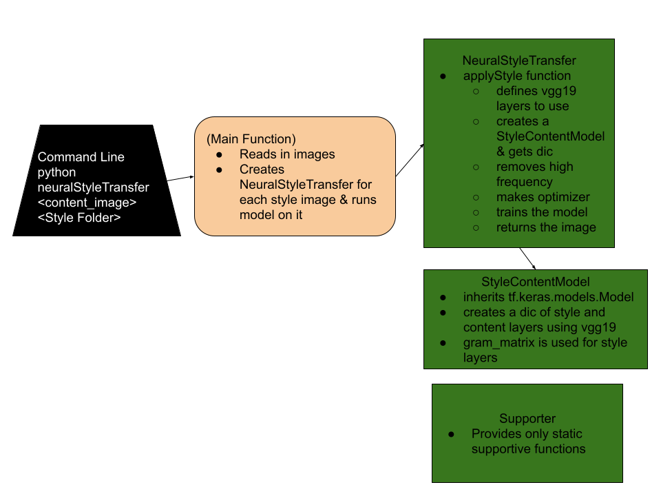

# GANPlayground

To run, call:
python neuralStyleTransfer <content_image> <Folder with style images>

Example:
python neuralStyleTransfer myImg.jpg StyleImages

Note- still working out bugs
Current code based on Tensorflow tutorial:
https://www.tensorflow.org/tutorials/generative/style_transfer

